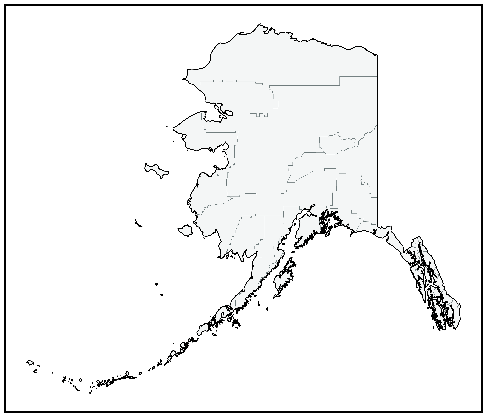
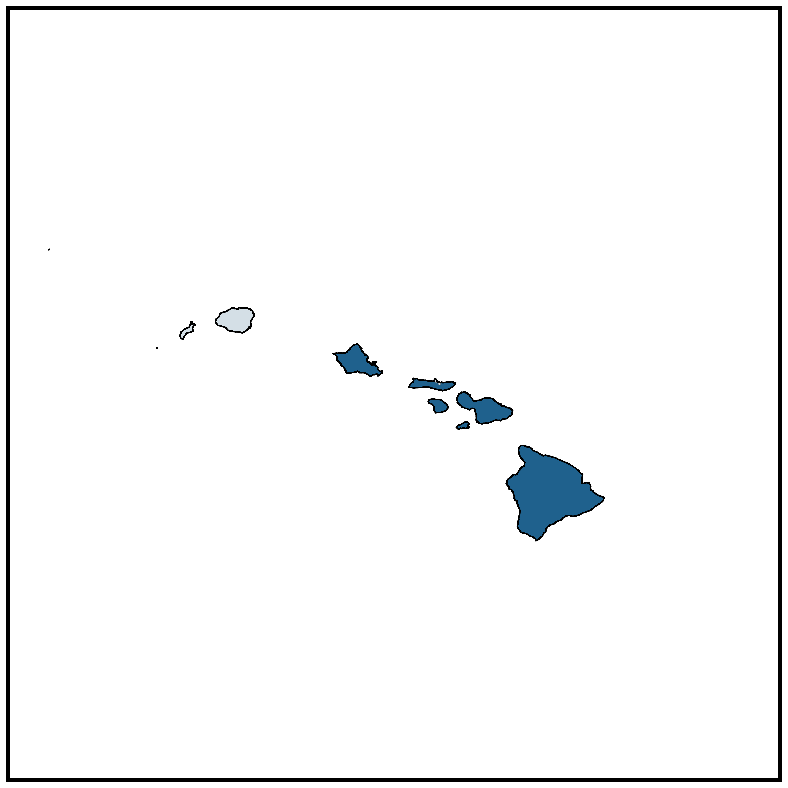
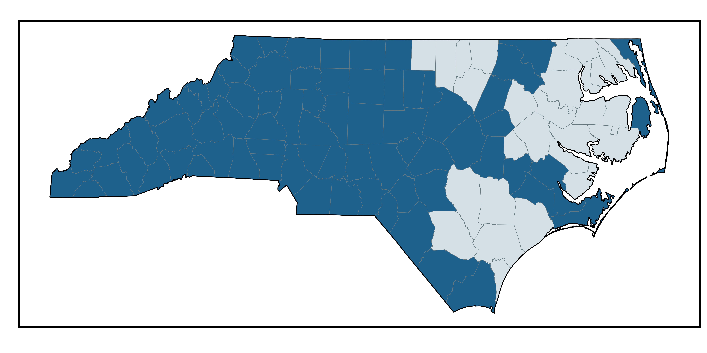
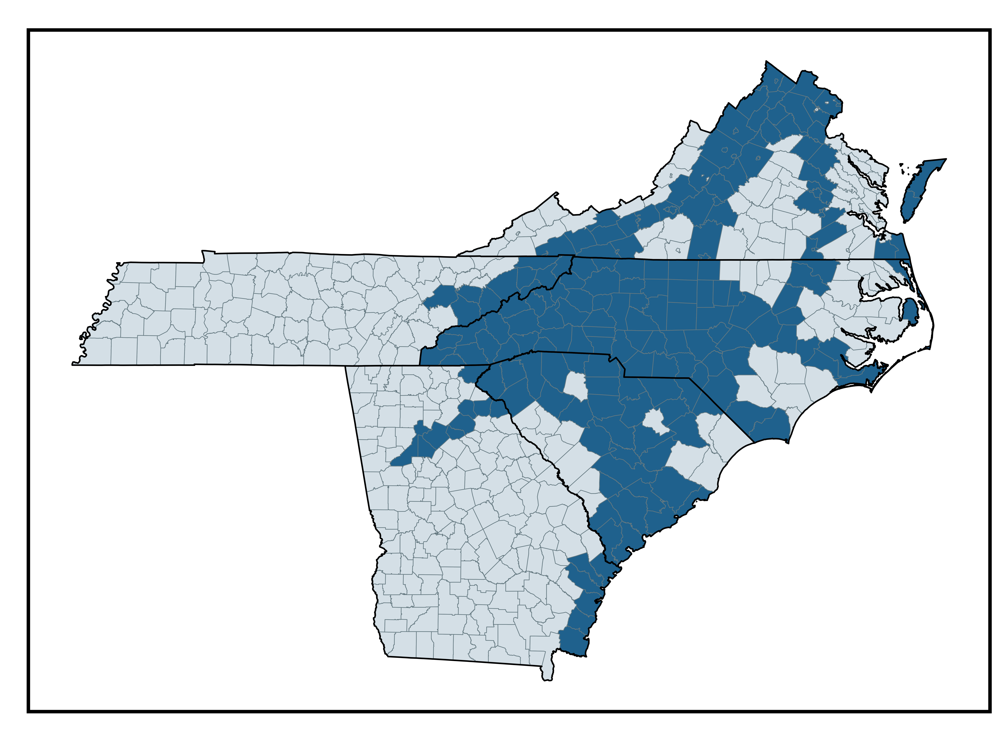

# Tracking Counties

A Streamlit app for tracking US counties visited. View the live app at **[tracking-counties.streamlit.app](https://tracking-counties.streamlit.app/)**.

## Features

- **Interactive Map** — Folium-based map with color-coded visited/unvisited counties and states. Hover tooltips show county name, state, FIPS code, and visit date.
- **Data Table** — Filterable table with search by state and visit status. Displays real-time counts of visited and unvisited counties.
- **Static Plots** — High-resolution plotnine maps for the contiguous US, Alaska, Hawaii, and North Carolina (with and without adjacent states). Downloadable as PNG.

## Plots

### Contiguous United States


### Alaska


### Hawaii


### North Carolina


### North Carolina and Adjacent States


## Tech Stack

| Category | Library |
|---|---|
| App framework | Streamlit 1.50.0 |
| Interactive maps | Folium + streamlit-folium |
| Static maps | plotnine |
| Geospatial data | GeoPandas, pygris |
| Data manipulation | pandas, siuba |

County and state boundary files are fetched automatically at runtime via [pygris](https://walker-data.com/pygris/) using the US Census Bureau 2023 cartographic boundary files.

## Local Development

**Prerequisites:** [uv](https://docs.astral.sh/uv/)

```bash
# Install dependencies
make sync

# Launch the app
make launch
```

The app runs at `http://localhost:8501`.

Other make targets:

```bash
make lint     # Run Ruff linter
make format   # Format code with Black
make clean    # Remove build artifacts
```

## Project Structure

```
trackingcounties/
├── app.py                        # Entry point — dashboard summary page
├── pages/
│   ├── 1_Interactive_Map.py
│   ├── 2_Data_Table.py
│   └── 3_Static_Plots.py
├── src/
│   ├── config.py                 # Constants (projection, colors, plot dimensions)
│   ├── generate_plots.py         # Standalone script for regenerating static plots
│   ├── paths.py                  # Project root and data directory paths
│   └── scripts/
│       ├── data.py               # Data import (CSV + shapefiles via pygris)
│       ├── mapping.py            # CRS and meridian utilities
│       ├── plotting.py           # Plot generation
│       └── processing.py        # Data processing and joins
├── data/
│   ├── plots/                    # Auto-generated static map PNGs
│   └── tables/
│       └── list_of_counties_active.csv   # County visit records
├── config.json                   # Interactive map style config
└── .github/workflows/
    └── update-plots.yml          # Auto-regenerate plots on CSV change
```

## Data

Visit data lives in `data/tables/list_of_counties_active.csv`. Each row is a US county with fields for state, county name, FIPS code, visit date, and notes.

## Automation

A GitHub Actions workflow triggers on any push to `master` that modifies the CSV. It regenerates all static plots and commits them back to the repo. Shapefile downloads are cached between runs.
